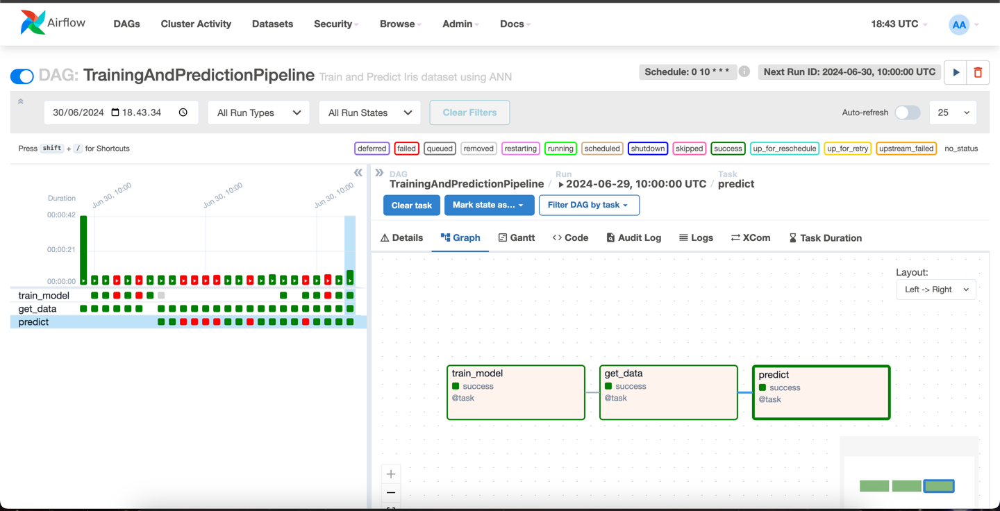
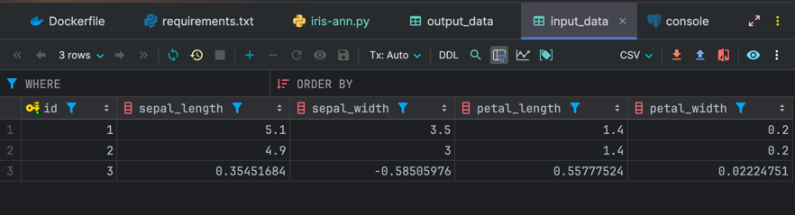
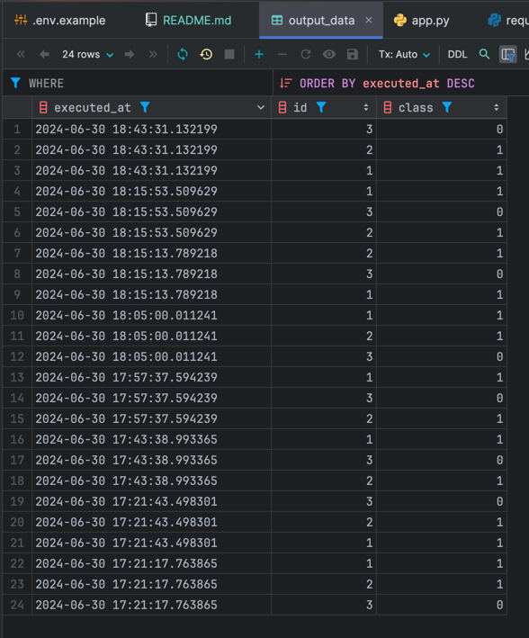

# Iris ANN Deployment (eFishery)

## Description
This repository contains the deployment of the Iris ANN model using Apache Airflow. Model will be trained every day at 10am. The Iris ANN model is trained using the Iris dataset from Scikit-learn. The model is trained using the `airflow/dags/iris-ann.py` script and the model is saved as a pickle. The Flask app is used to serve the model and the Airflow is used to schedule the model training and prediction.


## Requirements
- Docker
- Python 3.12
- Flask
- Airflow
- Scikit-learn
- Numpy
- Pickle
- Postgres

## How to run scheduled job for training Iris ANN model



1. Clone this repository
2. Run the following command to build the docker image
```bash
docker-compose -f airflow-server.yaml build
docker-compose -f airflow-server.yaml up -d
```
3. Open the browser and go to `http://localhost:8080/` to access the Airflow UI
4. Create a new connection with the following configuration
    - Conn Id: `local_postgres`
    - Conn Type: `Postgres`
    - Host: `postgres`
    - Schema: `iris_ann`
    - Login: `apps_user`
    - Password: `apps_user`
    - Port: `5432`
6. Open dag named TrainingAndPredictionPipeline
7. Turn on the dag and schedule the dag to run every day at 10am
8. The model will be trained every day at 10am
9. The model will be saved as a pickle in the `airflow/dags/model` directory and also predict data from input_data table on postgres and saved the result to output_data table on postgres.

- 
- 

## How to run the Flask app to serve the model
1. Run the following command to build the docker image
```bash
flask run
```
2. Open the postman and send a POST request to `http://localhost:5000/predict` like this example JSON data
```json
[
    {
       "sepal_length": 5.7,
       "sepal_width": 2.9,
       "petal_length": -0.1,
       "petal_width": 2.3
   },
   {
       "sepal_length": 1.7,
       "sepal_width": 1.9,
       "petal_length": -0.1,
       "petal_width": 0.3
   },
   {
       "sepal_length": 3.7,
       "sepal_width": 5.9,
       "petal_length": -0.1,
       "petal_width": 6.3
   }
]
```
3. The result will be returned as a JSON response
```json
[
    1,
    1,
    2
]
```

## Reference
- https://hub.docker.com/r/bitnami/airflow
- https://fernetkeygen.com/
- https://www.kaggle.com/code/kavyas21itr052/iris-ann/notebook